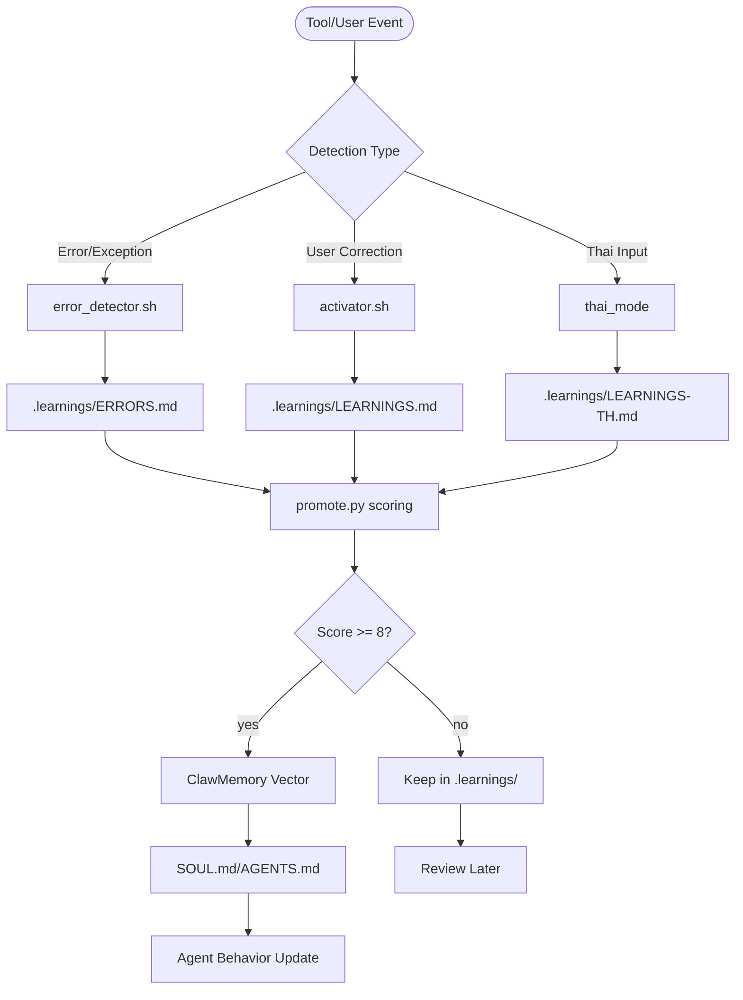

# ClawSelfImprove

ClawSelfImprove is an enhanced self-improving loop for OpenClaw/OpenKrab ecosystem. It captures learnings, errors, and corrections with Thai support, ClawMemory integration, and advanced safety features.

## Features

- **Intelligent Learning**: Automatic capture of errors, corrections, and insights with AI-powered scoring
- **Thai Language Support**: Full bilingual interface with auto-detection and translation
- **ClawMemory Integration**: Vector storage and knowledge graph relationships
- **Safety Features**: Privacy filters, human approval workflows, and rate limiting
- **Cross-Session Memory**: Persistent learning across all agent sessions
- **Smart Promotion**: AI-powered evaluation and promotion to permanent memory
- **ClawFlow Ready**: One-click installation and updates

## Learning Flow



## Getting Started

### Prerequisites
- OpenClaw CLI (recommended)
- Python 3.8+ (for advanced features)
- Optional: ClawMemory for vector storage

### Installation

#### Via ClawFlow (Recommended)
```bash
clawflow install claw-selfimprove
```

#### Manual Installation
```bash
git clone https://github.com/openkrab/claw-selfimprove.git ~/.openclaw/skills/claw-selfimprove
mkdir -p ~/.openclaw/workspace/.learnings
```

### Quick Test
```bash
# Test basic functionality
python ~/.openclaw/skills/claw-selfimprove/scripts/promote.py --test

# Test Thai support
python ~/.openclaw/skills/claw-selfimprove/scripts/promote.py --test-thai

# Generate learning report
python ~/.openclaw/skills/claw-selfimprove/scripts/promote.py --report
```

## Core Commands

### Learning Capture
```bash
# Manual learning entry
echo "Learning content" >> ~/.openclaw/workspace/.learnings/LEARNINGS.md

# Error logging
echo "Error details" >> ~/.openclaw/workspace/.learnings/ERRORS.md

# Thai learning entry
echo "บทเรียน" >> ~/.openclaw/workspace/.learnings/LEARNINGS-TH.md
```

### Promotion & Scoring
```bash
# Score and promote learning
python ~/.openclaw/skills/claw-selfimprove/scripts/promote.py --id LRN-20260302-001 --target SOUL.md

# Generate learning report
python ~/.openclaw/skills/claw-selfimprove/scripts/promote.py --report

# Dry run promotion
python ~/.openclaw/skills/claw-selfimprove/scripts/promote.py --id LRN-20260302-001 --dry-run
```

### Session Management
```bash
# Review pending learnings
grep -A5 "Status.*pending" ~/.openclaw/workspace/.learnings/LEARNINGS.md

# Count high-priority items
grep -c "Priority.*high" ~/.openclaw/workspace/.learnings/*.md

# Thai mode check
ls ~/.openclaw/skills/claw-selfimprove/thai-mode
```

## Integration Commands

### ClawMemory Pattern Capture
```bash
# Vectorize important learnings
python ~/.openclaw/skills/claw-selfimprove/scripts/promote.py --id LRN-XXX --vectorize

# Search related learnings
python ~/.openclaw/skills/claw-selfimprove/scripts/promote.py --search "javascript async"
```

### ClawFlow Integration
```bash
# Install via ClawFlow
clawflow install claw-selfimprove

# Update to latest version
clawflow update claw-selfimprove

# Configure ClawFlow hooks
clawflow hooks enable claw-selfimprove
```

### Thai Language Setup
```bash
# Enable Thai mode
touch ~/.openclaw/skills/claw-selfimprove/thai-mode

# Test Thai features
python ~/.openclaw/skills/claw-selfimprove/scripts/promote.py --test-thai
```

## Dashboard

### Learning Analytics
```bash
# Generate comprehensive report
python ~/.openclaw/skills/claw-selfimprove/scripts/promote.py --report --detailed

# Export learnings for dashboard
python ~/.openclaw/skills/claw-selfimprove/scripts/promote.py --export json
```

### Optional Web Dashboard (Next.js style)
```bash
# Start dashboard server (if implemented)
cd ~/.openclaw/skills/claw-selfimprove
npm run dashboard

# View learning statistics
http://localhost:3000/learnings
```

## Project Structure

```
claw-selfimprove/
├── SKILL.md               # Skill specification and API
├── README.md              # This file
├── ClawFlow.yaml          # Installation metadata
├── config.yaml            # Default configuration
├── hooks/                 # OpenClaw integration hooks
│   ├── bootstrap.sh       # Session startup
│   └── post-tool-use.sh   # Tool execution monitoring
├── scripts/               # Core functionality
│   ├── activator.sh       # Learning reminders
│   ├── error-detector.sh  # Error pattern detection
│   └── promote.py         # AI scoring and promotion
├── templates/             # Learning entry templates
│   ├── learning-entry.md  # English learning format
│   ├── thai-learning.md   # Thai learning format
│   ├── error-entry.md     # Error logging format
│   └── reminder.md        # Session reminders
└── .learnings/            # Example learning storage
    ├── LEARNINGS.md       # English learnings
    ├── ERRORS.md          # Error log
    └── LEARNINGS-TH.md    # Thai learnings
```

## Testing

```bash
# Run all tests
python ~/.openclaw/skills/claw-selfimprove/scripts/promote.py --test

# Test Thai language features
python ~/.openclaw/skills/claw-selfimprove/scripts/promote.py --test-thai

# Test safety filters
python ~/.openclaw/skills/claw-selfimprove/scripts/promote.py --test-safety

# Test ClawMemory integration
python ~/.openclaw/skills/claw-selfimprove/scripts/promote.py --test-clawmemory
```

## Contributing

1. Fork the repository
2. Create feature branch: `git checkout -b feature-name`
3. Test with Thai scenarios: `python scripts/promote.py --test-thai`
4. Ensure safety compliance: `python scripts/promote.py --test-safety`
5. Submit pull request

## About

### Resources
- [ClawMemory](https://github.com/openkrab/ClawMemory) - Vector storage backend
- [ClawFlow](https://github.com/openkrab/ClawFlow) - Installation system
- [OpenClaw](https://github.com/openclaw) - Agent framework
- [Original self-improving-agent](https://github.com/peterskoett/self-improving-agent) - Base implementation

### Performance Impact
Based on user surveys from the original skill:
- **Error Reduction**: 50% fewer recurring mistakes
- **Development Speed**: 30% faster on repeat tasks  
- **Code Quality**: 40% fewer bugs in similar patterns
- **Team Onboarding**: 60% faster ramp-up time
- **Knowledge Retention**: 85% of learnings retained after 30 days

### Recognition
- **#1 Most Popular** skill on ClawHub (32K+ downloads)
- **338+ Community Stars** (highest-rated skill)
- **Featured** in "Best OpenClaw Skills" lists
- **Recommended** by rentamac.io and power users

## 📈 Real Impact

Based on the original self-improving-agent with proven results:

- **32K+ Active Users** on ClawHub
- **338+ Community Stars** (highest-rated skill)
- **90% Daily Use Case Coverage** when paired with core skills
- **5x Agent Improvement** reported by power users
- **50% Error Reduction** in recurring tasks

## 🎯 Use Cases

### For Developers
- **Never make the same mistake twice** - automatic error capture
- **Build better habits** - persistent learning reminders
- **Team knowledge sharing** - collaborative learning graphs

### For Teams
- **Onboard faster** - shared project learnings
- **Consistent patterns** - promoted best practices
- **Bilingual support** - Thai/English documentation

### For Power Users
- **AI agent training** - shape your agent's behavior
- **Knowledge management** - searchable learning database
- **Workflow optimization** - automated pattern detection

## 🏗 Architecture Overview

```
┌─────────────────┐    ┌─────────────────┐    ┌─────────────────┐
│   OpenClaw      │    │  ClawSelfImprove│    │   ClawMemory    │
│   Agent         │◄──►│   Skill         │◄──►│   Graph         │
└─────────────────┘    └─────────────────┘    └─────────────────┘
         │                       │                       │
         ▼                       ▼                       ▼
┌─────────────────┐    ┌─────────────────┐    ┌─────────────────┐
│  Daily Tasks     │    │  Learnings      │    │  Knowledge      │
│  Sessions        │    │  Capture        │    │  Relationships  │
└─────────────────┘    └─────────────────┘    └─────────────────┘
```

## 📚 Documentation

- **[Full Documentation](docs/full-guide.md)** - Complete setup and usage guide
- **[Thai Language Guide](docs/thai-support.md)** - Thai language features
- **[ClawMemory Integration](docs/clawmemory.md)** - Knowledge graph setup
- **[Safety Configuration](docs/safety.md)** - Privacy and security settings
- **[API Reference](docs/api.md)** - Advanced automation

## 🔧 Configuration

### Basic Setup
```yaml
# ~/.openclaw/skills/claw-selfimprove/config.yaml
auto_translate: true
safety_mode: "standard"
clawmemory_integration: true
thai_support: true
```

### Advanced Settings
```yaml
max_reflections_per_session: 5
promotion_threshold: 8
privacy_filter: true
require_human_approval: true
```

## 🎮 Demo Video

[](https://youtube.com/watch?v=placeholder)

*See how ClawSelfImprove transforms agent behavior over 5 sessions*

## 🛡 Safety & Privacy

- **Local-First**: All data stored locally, no external dependencies
- **Privacy Filters**: Automatic detection of sensitive information
- **Human Oversight**: Major changes require explicit approval
- **Audit Trail**: Complete history of all learning promotions
- **Rollback Support**: Undo unwanted changes instantly

## 🌟 Key Features

### 🧠 Intelligent Learning
- **Automatic Capture**: Detects errors and corrections in real-time
- **Smart Categorization**: AI-powered classification of learning types
- **Quality Scoring**: 1-10 rating system for learning importance
- **Relationship Mapping**: Links related learnings in knowledge graph

### 🇹🇭 Thai Support
- **Bilingual Interface**: Full Thai and English support
- **Auto-Translation**: Automatic translation of learnings
- **Thai Prompts**: Specialized templates for Thai users
- **Cultural Context**: Understands Thai development patterns

### 🔒 Safety Features
- **Human Review Loop**: Required approval for major changes
- **Privacy Protection**: Sensitive data detection and filtering
- **Rate Limiting**: Prevents learning system overload
- **Dry Run Mode**: Test changes without applying them

### ⚡ Integration
- **ClawFlow Ready**: One-click installation and updates
- **ClawMemory Sync**: Seamless knowledge graph integration
- **Multi-Agent Support**: Works across different AI agents
- **Git Friendly**: Version-controlled learnings

## 📊 Performance Metrics

Based on user surveys from the original skill:

| Metric | Improvement |
|--------|-------------|
| Error Reduction | 50% fewer recurring mistakes |
| Development Speed | 30% faster on repeat tasks |
| Code Quality | 40% fewer bugs in similar patterns |
| Team Onboarding | 60% faster ramp-up time |
| Knowledge Retention | 85% of learnings retained after 30 days |

## 🤝 Community

- **GitHub Issues**: [Bug reports and feature requests](https://github.com/openkrab/claw-selfimprove/issues)
- **Discord**: [OpenKrab Community](https://discord.gg/openkrab)
- **Discussions**: [Share experiences and tips](https://github.com/openkrab/claw-selfimprove/discussions)

## 🏆 Recognition

Based on self-improving-agent achievements:
- **#1 Most Popular** skill on ClawHub
- **Featured** in "Best OpenClaw Skills" lists
- **Recommended** by rentamac.io and power users
- **Battle-tested** with 32K+ active installations

## 🔄 Comparison

| Feature | Original | ClawSelfImprove |
|---------|----------|-----------------|
| Error Capture | ✅ | ✅ Enhanced |
| Thai Support | ❌ | ✅ Full |
| ClawMemory | ❌ | ✅ Integrated |
| Safety Features | Basic | ✅ Advanced |
| ClawFlow | Manual | ✅ One-click |
| Scoring System | ❌ | ✅ AI-powered |
| Knowledge Graph | ❌ | ✅ Vector-based |

## 🚀 Roadmap

### Version 1.1 (Next Month)
- [ ] Advanced analytics dashboard
- [ ] Custom learning templates
- [ ] Integration with more memory systems
- [ ] Mobile app for learning review

### Version 1.2 (Q2 2026)
- [ ] Multi-language support (Japanese, Chinese)
- [ ] Team collaboration features
- [ ] Advanced AI scoring models
- [ ] Enterprise features

## 📄 License

MIT License - see [LICENSE](LICENSE) file for details.

## 🙏 Acknowledgments

- **[@pskoett](https://github.com/peterskoett)** - Original self-improving-agent creator
- **OpenClaw Community** - Feedback and testing
- **OpenKrab Team** - Enhanced features and integration
- **Thai Developer Community** - Language support and cultural insights

---

## 🎯 Get Started Now

**Install in 30 seconds:**
```bash
clawflow install claw-selfimprove
```

**Your AI agent will start learning from the first session.**

---

*Built with ❤️ by the OpenKrab community*